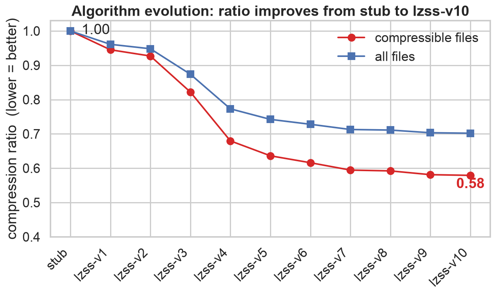
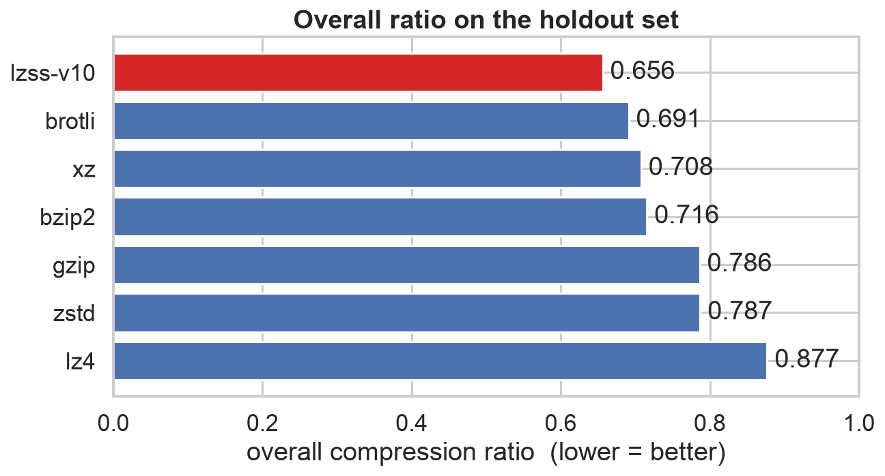
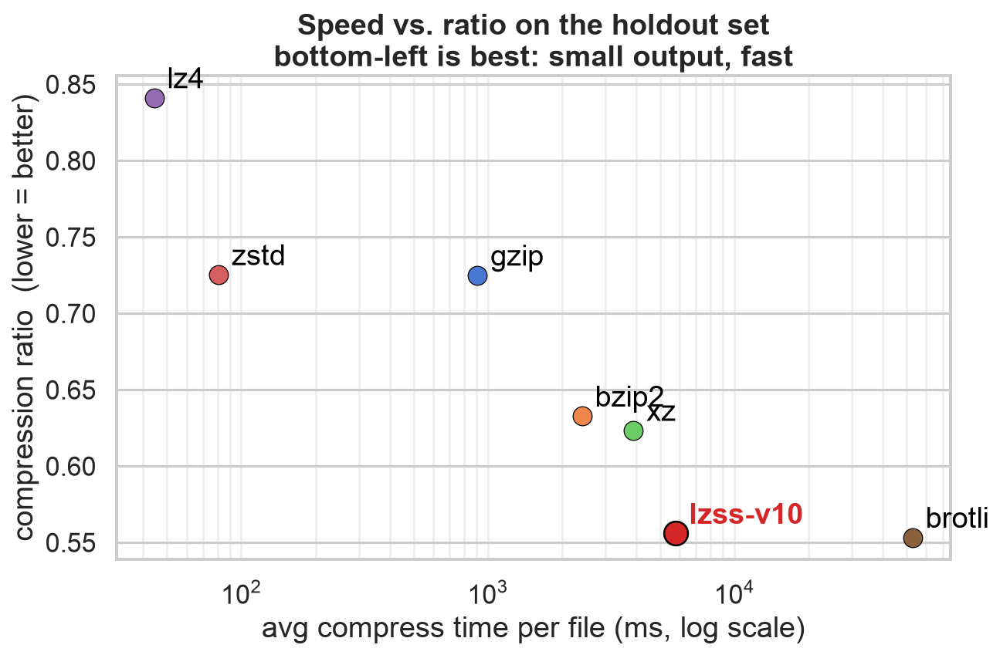
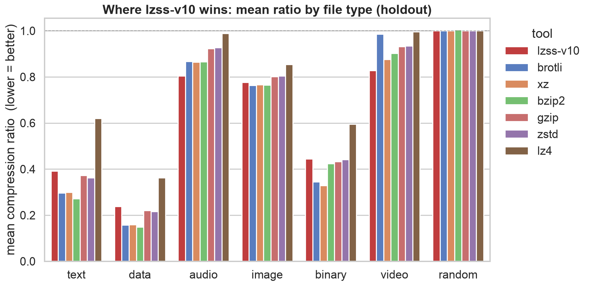

# compress-test

An experiment in building a lossless compressor from scratch in Rust, tuned for
PCM audio. It evolves from a do-nothing stub into **lzss-v10** — an LZSS core
with Huffman entropy coding, multi-stride delta filters, and audio-specific
prediction. A write-up is linked here later.

Ratio is `compressed / original`, so **lower is better**. Charts are generated
from the benchmark CSVs with `uv run make_charts.py`.

## Charts

**Algorithm evolution** — compression ratio across each version, from the stub
to lzss-v10, on the training set.

**Overall ratio by tool** — lzss-v10 against gzip, bzip2, xz, zstd, lz4 and
brotli on the holdout set.

**Speed vs. ratio** — the trade-off between compression time and ratio across
all tools on the holdout set.

**Ratio by file type** — mean compression ratio per file type (audio, text,
data, image, …) for each tool on the holdout set.

| tool | text | data | audio | image | binary | video | random |
|---|---|---|---|---|---|---|---|
| **lzss-v10** | 0.392 | 0.238 | 0.804 | 0.776 | 0.444 | 0.827 | 1.000 |
| brotli | 0.296 | 0.157 | 0.867 | 0.764 | 0.344 | 0.986 | 1.000 |
| xz | 0.300 | 0.159 | 0.864 | 0.767 | 0.329 | 0.877 | 1.000 |
| bzip2 | 0.271 | 0.149 | 0.866 | 0.766 | 0.424 | 0.903 | 1.005 |
| gzip | 0.373 | 0.220 | 0.924 | 0.801 | 0.433 | 0.932 | 1.000 |
| zstd | 0.362 | 0.216 | 0.928 | 0.804 | 0.442 | 0.934 | 1.000 |
| lz4 | 0.620 | 0.362 | 0.989 | 0.854 | 0.595 | 0.997 | 1.000 |
